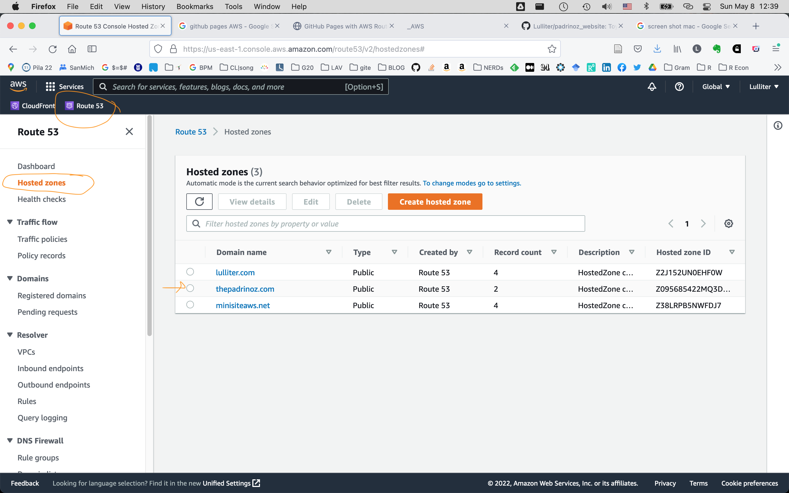
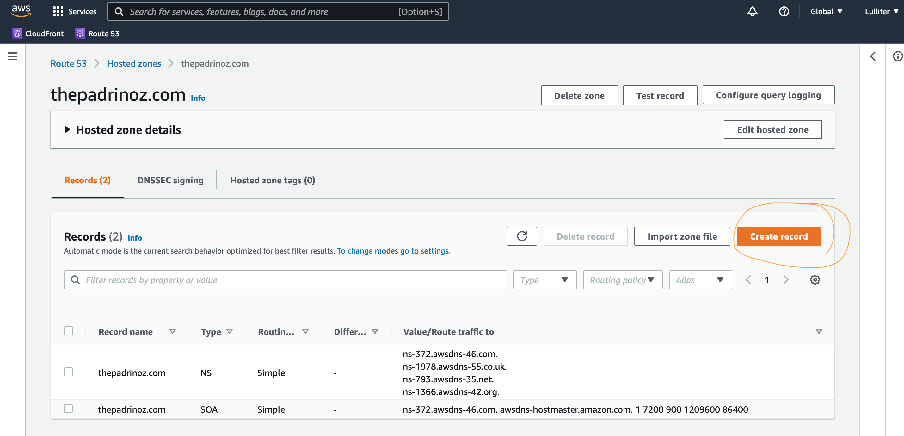
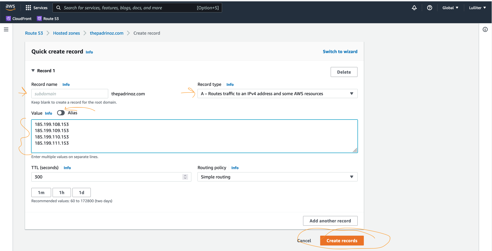
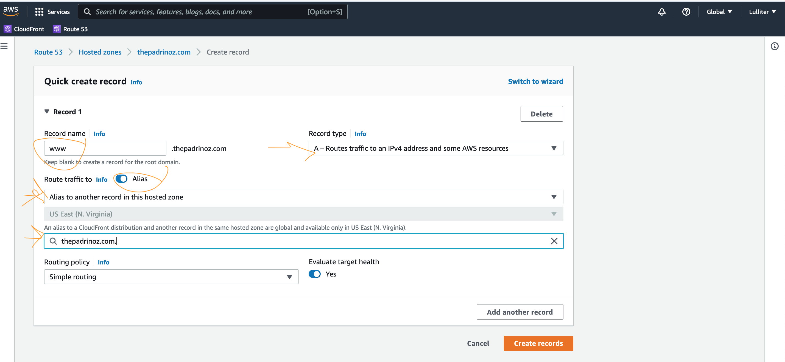
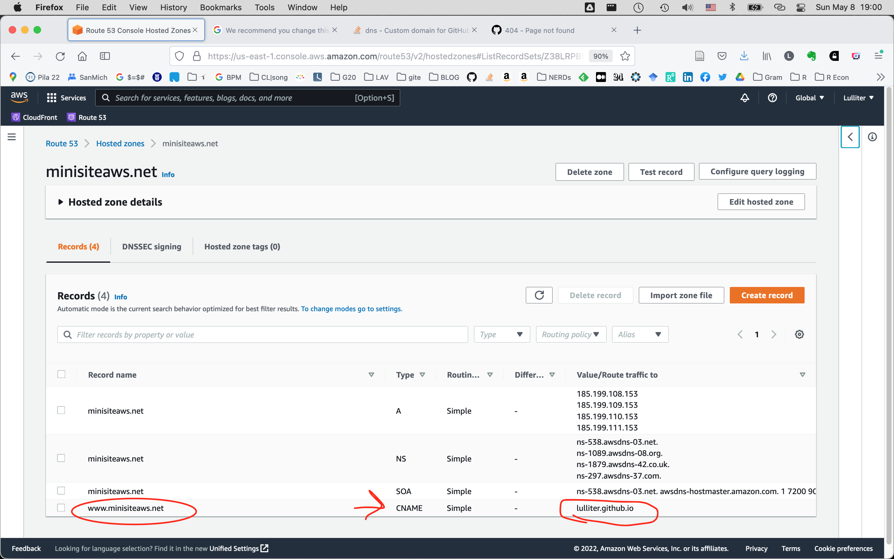

```{r setup, include=FALSE}
knitr::opts_chunk$set(echo = FALSE)
```

# Instructions for website {Github Pages + AWS}

The following steps guide through setting up a new website that is hosted on
**GitHub Pages**and - since GitHub Pages supports using custom
domains to subsequently re-direct the site's URL from the
default `<user>.github.io/domain` to a custom domain name registered on
**AWS**.

I tested these when setting up/re-directing a toy website for my band 🎸 🥁 🎹 🎤
**"The Padrinoz"** (feel free to check outt the repo with [code](https://github.com/Lulliter/padrinoz_website) and _unofficial_ [site](https://thepadrinoz.com/))


## on GitHub: initiate a repo in the usual way

1.  Create a new repo on github
2.  Go on local PARENT directory of the intended repo
3.  Execute

``` bash
git clone https://github.com/Lulliter/padrinoz_website.git
```

4.  always from the PARENT dir of the REPO run

``` r
 library(distill)
 create_website(dir = "padrinoz_website",
 title = "The Padrinoz",
 gh_pages = TRUE)
```

then you can customize and enrich, but I am not discussing this here...

## on AWS: Buy a domain

-   on AWS: Go to **Route53**, under *'register domain'* then follow
    instructions to buy a domain (10\$ /12\$ per year), in my case: *`thepadrinoz.com`*.
-   on **AWS_Route53**: domain registration should be done automatically
    -   first, it will appear under DOMAINS --\> Pending Requests [a
        verification email will be sent by AWS]
    -   after it will be under DOMAINS --\> Registered Domains

## on GitHub: deploy website via Github Pages

-   on Github: Scroll down to the Repo / Setting/ Github Pages section
    `click the drop down menu under “Source” and click “master branch”`
-   on Local: make some adaptation / add content
-   (on Terminal/RStudio: Build the site locally <!-- (or see `./build_site.R`)) -->
<!-- -   actually, now the shell script `./_render-deploy.sh` invokes and -->
<!--     run `./build_site.R` -->
-   on Terminal/RStudio: git add/commit/push (or see
    `./_render-deploy.sh`)

## on local: CNAME

Looking forward, we will need to have a file named `CNAME` that contains
a single row: your custom domain (in this case: `thepadrinoz.com`) +
create + commit + push

NOTE: ❗ Before adding/committing to repo `CNAME`, at every push, the custom
domain gets decoupled from GH Pages settings❗ 

## on AWS: redirect the domain to my website on Github pages

Following
[blog](https://medium.com/@benwiz/how-to-deploy-github-pages-with-aws-route-53-registered-custom-domain-and-force-https-bbea801e5ea3)
and
[GITHUB](https://help.github.com/en/articles/setting-up-an-apex-domain)

1.  Log into AWS Console --\> **Route53**
2.  In your **Route53** dashboard, click *hosted zones*



3.  Click Click the domain you would like to use 



4.  Click *Create Record* (This will be your yourdomain.com rule)
    -   Do not enter anything into the Name field
    -   Under the Type dropdown, select A --- IPv4 addresses
    -   The Alias toggle should be UNSELECTED
    -   Enter the following four IP addresses into the value text area.

``` 
185.199.108.153
185.199.109.153
185.199.110.153
185.199.111.153
```

-   Then click ~~Save Record Set~~ "Create Record" .



5.  Third, create another A type of record set. And this will be your
    www.yourdomain.com rule. And it will be an alias for yourdomain.com.

    -   Click Create Record Set, again
    -   Into the Name field, enter **'www'**
    -   Under the Type dropdown, select A --- IPv4 addresses, again
    -   SELECT Alias on the dashboard, from dropdown menu, choose
        **"Alias to another record in this hosted zone"** and then
        **"yourdomain.com."** (it has the full stop!?!)
    -   Then click ~~Save Record Set~~ "Create Record" .



6.  Last, go back to Github repository's settings tab

    -   Scroll down to the GitHub Pages section
    -   In the Custom domain field enter your custom domain:
        your-custom-domain.com
    -   Click Save
    -   Check Enforce HTTPS

7.  Lastest, go to "\_site.yml" and replace `base_url`

``` r
name: "padrinoz_website"
title: "The Padrinoz"
base_url: https://thepadrinoz.com
```

8.  fix GHPages error asking me to point www.domain.com to a CNAME
    record (instead of an A record)



# REFERENCE

-   [gitGitHub
    instructions](https://help.github.com/en/articles/setting-up-a-www-subdomain)
-   [Yeongho Kim's tutorial to set up a AWS Route 53 custom
    domain](https://yeonghoey.com/github/pages/#types-of-github-pages)
-   [Ben Wiz's guide to deploy GitHub pages' site with AWS Route
    53](https://medium.com/@benwiz/how-to-deploy-github-pages-with-aws-route-53-registered-custom-domain-and-force-https-bbea801e5ea3)
-   [Sai Chandu Bobbili's
    guide](https://medium.com/@bschandu67/host-your-website-using-github-pages-aws-route53-and-aws-cloudfront-7345493d2ea6)
