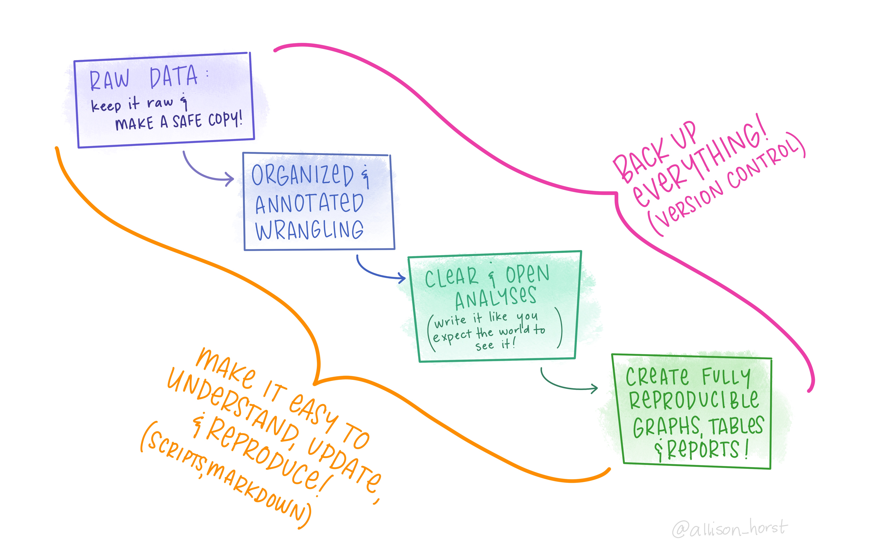

```{r setup, include=FALSE}
knitr::opts_chunk$set(echo = FALSE)

if (!require(pacman)) {install.packages(pacman)} 
pacman::p_load(distilltools) # needed to make incon (FA Academicons)+ links 
```

<!-- needs the \ -->


# Start at the _kernel_...

R was definitely my "gateway drug" to programming, but overtime I have been discovering the _magic_ of the command line and I am progressively becoming more at ease with *command-line interfaces (CLI)*  or `shell` scripting in all its flavors (`bash`, `zsh`, `git`, `make`) and enjoying their universal, dry and no-nonsense POWER!

+  Jeroen Janssens - **Set your R code free; turn it into a command-line tool** - 2022 - 
`r distilltools::icon_link("youtube", text = "video", "https://www.youtube.com/watch?v=2G3FjofP87o")`

# Geospatial Analysis... in R

+  Josiah Parry - **Exploratory Spatial Data Analysis in R** - 2022 - 
`r distilltools::icon_link("youtube", text = "video", "https://www.youtube.com/watch?v=i_MA1U6SJ1Y&t=1564s")`
+ Zev Ross - **[Workshop on] Modern Geospatial Data Analysis with R** - 2022 - 
`r distilltools::icon_link("file-powerpoint", text = "slides", "http://files.zevross.com/workshops/spatial/slides/html/0-deck-list.html")`                                        
 

## boh 

```{r}
distilltools::icon_link("github", text = "repo", "https://github.com/Lulliter/slogan")
distilltools::icon_link("link", text = "html", "https://lulliter.github.io/slogan/")
```