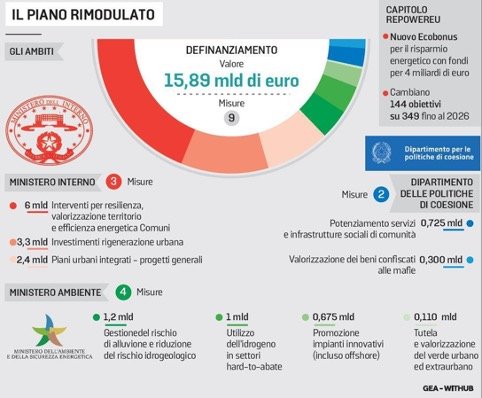

```{r setup, include=FALSE}
# Load required packages
if (!require("pacman")) {
	install.packages('pacman' )
}

# RStudio Addin to Insert Markdown Citations 
p_load_gh("crsh/citr") # not on CRAN (as of Jan 2023!)
# 2 use type shortcut: "cmd ' "
```

# PNRR

55 obiettivi (riforme e investimenti) entro il 2022

Dotazione complessiva

| Source (euro bn)      | A debito  | Fondo perduto | **TOT**   |
|-----------------------|-----------|---------------|-----------|
| [*EU*]{.underline}    |           |               |           |
| NGEU                  | 191.5     | 69.9          | **261.4** |
| ReactEU               |           | 13            | **13**    |
| [*ITA*]{.underline}   |           |               |           |
| Fondo complementare   |           | 30.64         | **30.64** |
| Piano Transizione 4.0 |           | 13.97         | **13.97** |
| **TOT**               | **191.5** | **127.51**    | **319.0** |

Di cui **"Rivoluzione Verde e transizione ecologica"** = **M2** becca **€ 59.33 Mld** (\~40%) divisa in 4 componenti:

Di cui al mezzogiorno, dovrebbe andare la soglia minima del 40%

Tranche ricevute:

-   2022 1o semestre € 45.9 Mld
-   2022 2o semestre € 21 Mld

# Dotazione per Ministero

### Ministero Sud e Coesione territoriale

Titolare di 4 misure:


+ Miss 5 Inclusione e Coesione Comp 3.  **Interventi speciali per la coesione territoriale** ➜ (€ 1.70 Mld)  
        

### MITE PNRR [roadmap](https://www.mite.gov.it/pagina/pnrr-roadmap) e [slide](https://www.mite.gov.it/sites/default/files/archivio/allegati/PNRR/slide_PNRR_agg2nov2021.pdf) \>

### MIPAAF
- Investimento 4.3  - Investimenti nella resilienza dell'agrosistema irriguo per una migliore gestione delle risorse idriche - 880 mln

# Dotazione per Missione                                                                                        

### Missione 1 (€ 40 mld) ➜ Digitalizzazione, Innov., Competit... (?) ➜ ? componenti                             
### Missione 2 (60 mld) ➜ Transizione Ecologica (MITE) ➜ 4 componenti                                            

**COMPONENTI**                                                                                                
1. **Economia circolare e agricoltura sostenibile** ➜ (€ 2.3 Mld) 
2. **Energia rinnovabile, idrogeno, rete e mobilita sostenibile** ➜ (€ 13.9 Mld) 
3. **Efficienza energetica e riqualificazione degli edifici** ➜ (€ 14.1 Mld) 
4. **Tutela del territorio e della risorsa idrica** ➜ (€ 4.1 Mld) [TOT = € 34.7 Mld] - riduzione dispersione risorse idriche | 
**M&T** (Milestones e Targets) 89/527 (totali)                                                                  

#### M2 C1. **Economia circolare e agricoltura sostenibile**

-   Realizzazione nuovi impianti di gestione rifiuti e ammodernamento esistenti ➜ € 1.5 Mld
-   Progetti "faro" di economia circolare ➜ € 600 mln
-   ***Riforme***:
    -   Strategia nazionale per l'economia circolare;
    -   Programma nazionale per la gestione dei rifiuti
    -   Supporto tecnico alle autorità locali
-   isole verdi ➜ € 200 mln
-   cultura e consap ➜ € 30 mln

> MIPAAF - Investimento 2.1 \| Sviluppo logistica per i settori agroalimentare,pesca e acquacoltura, silvicoltura, floricoltura e vivaismo -\> 800 mln - Investimento 2.2 \| Parco Agrisolare. -\> 1500 mln - Investimento 2.3 \| Innovazione e meccanizzazione nel settore agricolo e alimentare -\> 500 mln

#### M2 C2. **Energia rinnovabile, idrogeno, rete e mobilita sostenibile**

-   Sviluppo agro-voltaico ➜ € 1 Mld
-   Promozione rinnovabili per le comunità energetiche e l'auto-consumo ➜ € 2.2 Mld
-   Promozione impianti innovativi (incluso off-shore) ➜ € 675 mln
-   Sviluppo bio-metano ➜ € 1.9 Mld
-   ***Riforme***:
    -   Semplificazione delle procedure di autorizzazione per gli impianti rinnovabili on-shore e off-shore, nuovo quadro giuridico per sostenere la produzione da fonti rinnovabili e proroga dei tempi e dell'ammissibilità degli attuali regimi di sostegno
    -   Nuova normativa per la promozione della produzione e del consumo di gas rinnovabile
-   Rafforzamento di smart grid ➜ € 3,6 Mld
-   Interventi su resilienza climatica delle reti ➜ € 500 mln
-   Produzione di idrogeno in siti dismessi (*Hydrogen Valleys*) ➜ € 500 mln
-   Utilizzo dell'idrogeno in settori *hard-to-abate* ➜ € 2 Mld
-   Ricerca e sviluppo sull'idrogeno ➜ € 16 mln
-   ***Riforme***:
    -   Semplificazione amministrativa/riduzione ostacoli normativi a diffusione dell'idrogenoo
    -   Misure volte a promuovere la competitività dell'idrogeno
-   Sviluppo infrastrutture di ricarica elettrica ➜ € 741 mln
-   Idrogeno ➜ € 0.450 Mld

#### M2 C3. **Efficienza energetica e riqualificazione degli edifici**

-   Ecobonus e del Sismabonus fino al 110% per efficienza /sicurezza ➜ € 13.9 Mld
-   Sviluppo di sistemi di teleriscaldamento ➜ € 200 mln

#### M2 C4. **Tutela del territorio e della risorsa idrica**

-   Realizzazione di un sistema avanzato ed integrato di monitoraggio e previsione ➜ € 500 mln
-   Misure per la gestione del rischio di alluvione e per la riduzione del rischio idrogeologico ➜ € 1.3 Mld
-   ***Riforme***:
    -   Semplificazione e accelerazione procedure attuazione interventi dissesto idrogeologico
-   Tutela e valorizzazione del verde urbano ed extraurbano € 330 mln
-   Digitalizzazione dei parchi nazionali € 100 mln
-   Rinaturazione dell'area del Po € 360 mln
-   Bonifica dei siti orfani € 500 mln
-   Ripristino e tutela dei fondali e degli habitat marini € 400 mln

-   ***Riforme***: + Adozione di programmi nazionali di controllo dell'inquinamento atmosferico
    -   Investimenti in fognatura e depurazione € 600 mln
-   ***Riforme***: + Misure per garantire la piena capacità gestionale per i servizi idrici integrati

### Missione 3 (€ 25.4 mld) ➜ Infrastrutture per una mobilità sostenibile (?) ➜ ? componenti

### Missione 4 (€ 231 mld) ➜ Istruzione e ricerca (?) ➜ ? componenti

### Missione 5 (€ 20 mld) ➜ Inclusione e coesione (?) ➜ 3 componenti

**COMPONENTI**

1.  **Politiche per il lavoro** ➜ (€ ? Mld)
2.  **Infrastrutture sociali, famiglie, comunità e terzo settore** ➜ (€ ? Mld)
3.  **Interventi speciali per la coesione territoriale** ➜ (€ 1.70 Mld) - MinSUD


#### M5C3 - Inv 1.1.1  Aree interne - Potenziamento servizi e infrastrutture sociali di comunità
-   725 mln €
#### M5C3 - Inv 1.1.1 Aree Interne - servizi sanitari di prossimita 
-   100 mln €
#### M5C3 - Inv 1.2 Valorizzazione dei beni confiscati alle mafie
-   300 mln €
#### M5C3 - Inv 1.3 Interventi socio-educativi contro povertà educativa nel Mezzogiorno a sostegno del Terzo Settore
-   220 mln €
#### M5C3 - R 1.1 Semplificazione delle procedure e rafforzamento dei poteri del Commissario nelle Zone Economiche Speciali
-    0 mln €
 
### Missione 6 (? mld) ➜ Salute (?) ➜ ? componenti

# OPINIONI

+ [2022] **"È caotico dall'inizio"** 
>"Sia il NextGenEu, sia il Pnrr non si distinguono particolarmente per la chiarezza degli obiettivi e per i dettagli del programma di realizzazione. [...] Né essi si pongono il problema di valutare l'impatto economico e sociale dell'allocazione delle risorse e i benefici e i costi economici delle azioni proposte. [...] lo stato attuale del Pnrr dà l'impressione di un approccio caotico alla programmazione, con una molteplicità di progetti non coordinati, e di dubbia realizzabilità, e una gestione decentrata in difficoltà sia per la valutazione dei progetti stessi, sia per la loro implementazione. Mancano inoltre caratteristiche cruciali quali *modularità*, *replicabilità* e *rapidità di esecuzione* per un piano di investimenti che si propone realizzazioni di successo in tempi brevi. Queste condizioni sono inoltre particolarmente critiche nel Mezzogiorno." [@scandizzo_gli_2022]

-   Servono più informazioni sulla: a) spesa, b) milestones (qualit) e c) target (quanti)... A partire dal 2023 cominceranno a prevalere i target consistenti in risultati effettivamente misurabili, in lavori concretamente eseguiti, che sono una sfida assai più difficile [@zanardi2022]

# STATUS

+ [sett 2023 - PROGRESSO] **RATE erogate**
> non esiste una scadenza semestrale per la richiesta dei fondi Ue, bensì il vincolo da rispettare sono due richieste all’anno, non necessariamente ogni sei mesi


+ agosto 2021 - **pre-finanziamento da 24,9 miliardi € ** (pari al 13% del totale)

## 1 rata 
+ (Rich 30/12/21) -> 13 apr 2022 - **1a rata da 21 miliardi €** (tolta quota prefin = 3.9 mld) 

## 2 rata 
+ (Rich 29/06/22) -> 8 nov 2022 - **2a rata da 21 miliardi €** (tolta quota prefin = 3.1 mld) 

## 3 rata (ritardi)
+ (Rich 30/12/22) -> Sblocco 20/7/2023 -> 11 settembre 2023 - **3a rata da 18.5 miliardi €** (19 previsti, tolta quota prefin = 2.8 mld) 
+ *(3 relazione del Governo con risultati, stima spese, difficolta, revisione PNRR e RePowerEU[^2])*
 	+ esame piu lungo di Comm EU sui progetti x sblocco di fondi (concesssioni portuali | reti teleriscaldamento | PUI)


## [Modifica PNRR]
+ (Rich Cab Regia 20/7/2023) **chiede modifica 10 (su 27) obiettivi PNRR legati alla 4 rata** -> OK Comm 28/07/23 -> OK Consiglio Affari Generali dell'UE 19/09/23
	+ modifiche formali
	+ modifiche settoriali
	+ destinare 19,2 miliardi al nuovo capitolo RePowerEu per la transizione energetica anche grazie al definanziamento di una serie di interventi (per un valore pari a **15,9 miliardi**), con l’impegno a realizzarli comunque utilizzando fondi nazionali
	
+ Ecofin 8 dicembre darà l’approvazione definitiva [@bresolin_ecco_2023]. 


```{r, echo = FALSE, fig.align = 'center', out.width = '100%', results = 'markup'} 
  #"./_posts/2023-01-10-pnrr/CambioPNRR.jpg"
```

## 4 rata 
+ (Rich 22 sett 2023) - **4a rata da 16.5 miliardi €** 
	+ obiettivi includevano nuovo codice contratti pubblici[^1] 
	
## 5 rata 	
+ (Rich ??? 2024) -> mmm 202X - 5a rata da 18 miliardi € 

## 6 rata 
+ (Rich ??? 2024) -> mmm 202X - 6a rata da 11 miliardi € 


Mentre nel 2025 sul tavolo ci sono
+ ??? 2025 - 7a rata da 18 miliardi €
+ ??? 2025 - 8a rata da 11 miliardi €
+ ??? 2026 - 9a rata da 13 miliardi €
+ ??? 2026 - 10a rata da 18,1 miliardi €
		
+ [sett 2023 - Memoria Banca D'Italia] **"Il progresso nell’attuazione del Piano e l’erogazione delle rate di finanziamento"** 


[^1]: Come da M1C1-75 si accelera la digitalizzazione di contratti pubblici con un ecosotema integrato di piattaforme digitali che operano tra loro e con le banche dati esistenti: *PDND* (Piattaforma Digitale Nazionale  Dati) - Sistemi e BD di *ANAC* (Banca Dati Contratti Pubblici, Fascicolo Virtuale, .... )

[^2]: REPowerEU (maggio 2022) è la risposta dell'UE alle perturbazioni del mercato energetico globale causate anche dalla guerra Russo-Ucraina. Un Regolamento REPower EU (feb 2023) ha consentito di modificare i PNRR
