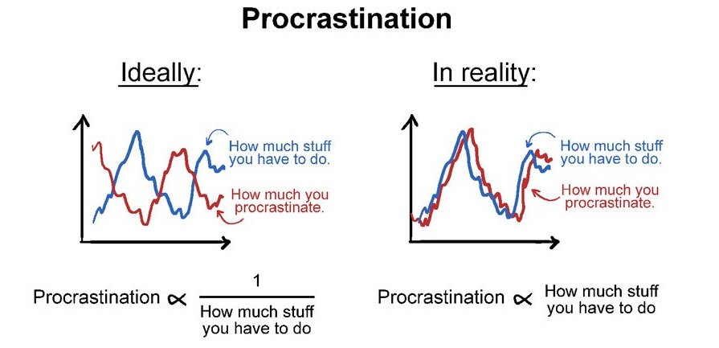

```{r setup, include=FALSE}
knitr::opts_chunk$set(echo = FALSE)
```


_the actual reason we are here... _ 😉




```{r eval=FALSE, fig.cap="Figure from Piled Higher and Deeper by Jorge Cham www.phdcomics.com", include=FALSE, out.extra="class=external"}
# NO! (bc can't get un-numbered caption)
knitr::include_graphics(here::here("images", "Phd_procr.jpg"))
```

_...but while we are at it:_  
 
### what is this website?

Mainly, a place to collect notes-to-self, `r fontawesome::fa("r-project", fill = "#5F85A7")` code snippets, half-baked ideas, and side-projects. <br>
I would love to blog more, but, for the moment, ideas are mostly in my head.   

### and who am I?   
<!-- _`whoami`_ -->
My name is **Luisa M. Mimmi**. I was born and raised in Italy 🇮🇹 , but I spent 14 years in the US 🇺🇸 based in Washington DC, working for multilateral development banks. Upon returning to Italy, I have been working as policy analyst for Italian government agencies. 

I am passionate about using data to understand and tackle various public policy issues, especially regarding economic development. So far, my main professional focus has been on solutions to provide essential housing and infrastructure services. 

For more details about my 'official' job see my [**CV (in English)**](https://raw.githubusercontent.com/Lulliter/cv/master/01_CV_Rmarkdown/Luisa-M-Mimmi_CV.pdf)/[**CV (in Italian)**](https://raw.githubusercontent.com/Lulliter/cv/master/02_CV_Rmarkdown_ITA/Luisa-M-Mimmi_CV_ITA.pdf)  

<!-- ---

### Presently busy with: 

- [Survey of WSS Suppliers in Brazil (as part of my IADB work)](https://lulliter.github.io/BrazilWaterSurvey/)
- [Survey of WSS Suppliers in Mexico (as part of my IADB work)](https://lulliter.github.io/MexicoWaterSurvey/)
 

- "If You Give a Judge a Risk Score: Evidence from Kentucky Bail Decisions"
    - [Full text](/about_files/albright_judge_score.pdf) & [Slides](/about_files/slides/ecineq_19.pdf) & [Blog post](https://thelittledataset.com/2019/07/15/if-you-give-a-judge-a-risk-score/)     
    
-->


